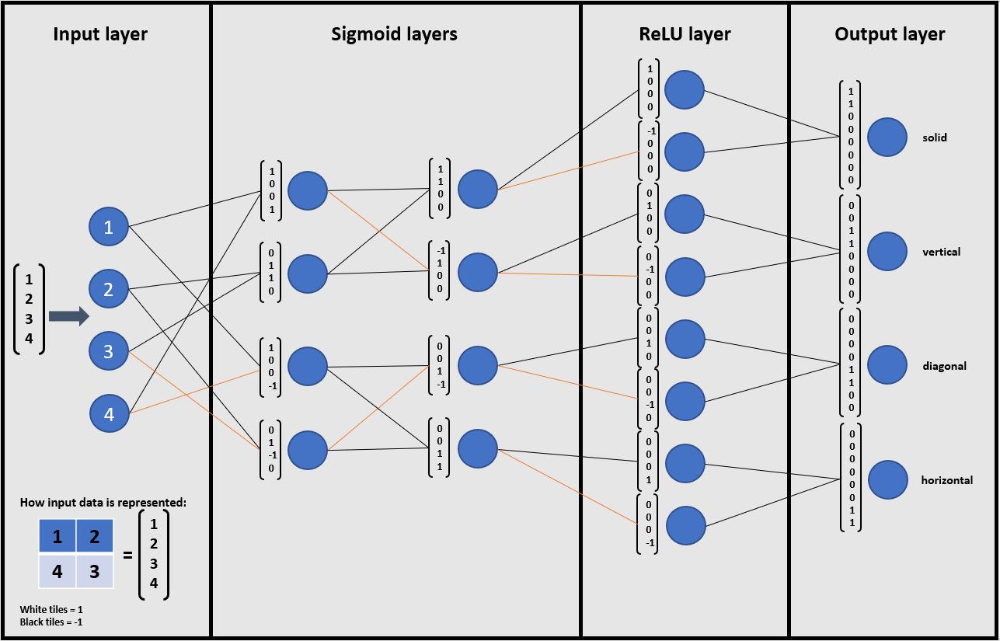

# Neural Network Built from Scratch

### Project:
This project was focused on building a basic neural network framework from scratch in Python,
using only built-in functions & math. This framework was built with the intention of implementing the
basic neural network example presented in [Brandon Rohrer's introductory YouTube video.](https://www.youtube.com/watch?v=ILsA4nyG7I0&ab_channel=BrandonRohrer)
The code I've written based on this video implements neurons with 4 functions: input, output, sigmoid squashing function, and rectified linear units (ReLUs).
Then, NeuralNetwork objects can be constructed with customizable layers. Weights must be manually selected.

### Implementation:
The main.py file contains the framework, while the network_test.py file contains a neural network implemented using the framework.
This neural network can take a 2x2 square of white & black tiles, and recognize certain patterns, such as: solid color, vertical lines, horizontal lines, and diagonal lines.
It contains an input layer of 4 neurons, 2 sigmoid layers of 4 neurons, 1 ReLU layer of 8 neurons, and an output layer of 4 neurons. 

### Visual Representation:
*This diagram shows the layers of the implemented neural network, with vectors representing weights shown next to individual neurons.*

### Extendibility:
While the framework was built with the intention of implementing the neural network example highlighted by Brandon Rohrer,
various other neural networks could be built using this same framework. By increasing the per-layer neuron count and modifying the weights accordingly,
a similar neural network could be built for 3x3 squares, for example.
